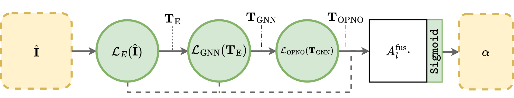

# Spectral1D: High-Order Euler Solver

A 1D Spectral Element Method solver for the Euler equations.

- **High-Order Accuracy**: Uses Gauss-Lobatto-Legendre quadrature and Lagrange polynomials for spatial discretization.
- **Physics**: Implements the 1D Euler equations with a Rusanov Riemann solver for robust interface flux treatment.
- **Time Integration**: 4th-order Runge-Kutta method.
- **HPC Optimized**:
    - **Unified Buffer Strategy**: Conserved variables are stored in contiguous global arrays to maximize CPU cache locality.
    - **BLAS Integration**

## Code Structure
- `[EARLY DEV PHASE : RBF base switch]` `lib/base/`: GLL basis and derivative matrix construction. POssibility to define RBF basis and RBF solving 
- `lib/phy/`: Euler flux functions and Riemann solver. Entropy conserving and entropy stable flux calculation from Charnesav.
- `lib/math` : Math helpers
- `lib/space/`: `Mesh` and `Element` classes managing the unified memory and spatial operator.
- `lib/time/`: Optimized `RK4` class and data export routines. The hybrid solver blends the entropy-stable DG and FV *subcell fluxes* per interface (`(1-a)B_dg + a B_fv`), matching `nn/jax_dgsem`, so a per-interface (nodal) blending factor stays conservative and entropy-stable.
- `lib/equinox/`: inference-only C++ runtime for the trained JAX/equinox alpha policy (`Conv1d`, `ResBlock`, `AlphaNet`). Loads a `.nnx` file produced by `nn/export/export.py` and reproduces the JAX `NodalAlphaModel` to machine precision. `[TODO: Convert OPNO+GNN policy to Equinox]`

## Hybrid Flux Blending FV/DGSEM solver
`JAX`-differentiable solver for CNN backpropagation.


## `JAX` Neural Network



Python GNN+OPNO framework to learn the behavior of the blending coefficient.

**Input:**
- Quadrature points residuals
- Energy spectrum of the element

**Encoder:** returns *Homogeneous token*

Homogenise the input token
- Polynomial order
- Mesh size

**Graph Neural Network:** returns *Neighbour-aware token*
- Data transfer between the elements

**Orthogonal Polynomial Neural Operator:** returns *Enriched energy spectrum + signal*
- From the energy spectrum and GNN token


Final **fusion layer**, sigmoid-activated.


- `nn/jax_dgsem` : `JAX`-differentiable DGSEM solver (previous section)
- `nn/muscl` : Python (non `JAX`-differentiable solver) diffusive solver, to generate reference solution (on a finer mesh). The solver is second-order accurate MUSCL scheme, with a `minmod` limiter to ensure stability of the solution, despite the really high resolution of the grid.
- `nn/network` : Networks structure (element, quadrature point scale or ModalOPNO)
- `nn/training` : Training policy of the network.


## Build & Compile
Requires `BLAS`, `LAPACK`, `BOOST_PROGRAM_OPTIONS`
```bash
mkdir build
cd build
../cmake
make
```
