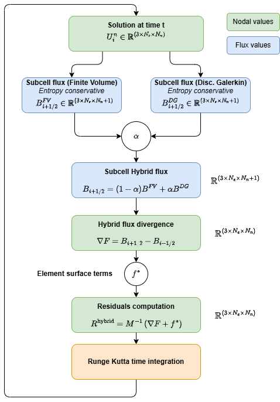
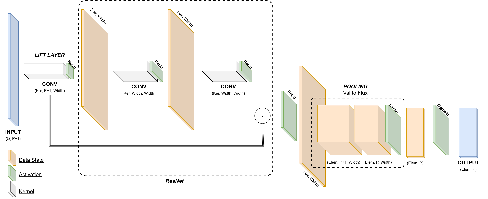
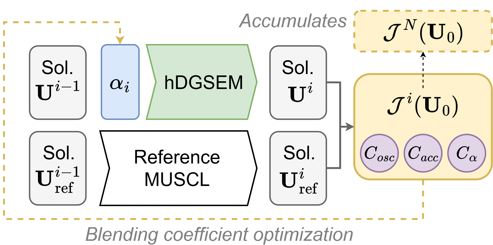

# Spectral1D: High-Order Euler Solver

A 1D Spectral Element Method solver for the Euler equations.

- **High-Order Accuracy**: Uses Gauss-Lobatto-Legendre quadrature and Lagrange polynomials for spatial discretization.
- **Physics**: Implements the 1D Euler equations with a Rusanov Riemann solver for robust interface flux treatment.
- **Time Integration**: 4th-order Runge-Kutta method.
- **HPC Optimized**:
    - **Unified Buffer Strategy**: Conserved variables are stored in contiguous global arrays to maximize CPU cache locality.
    - **BLAS Integration**: 

## Code Structure
- `lib/base/`: GLL basis and derivative matrix construction. POssibility to define RBF basis and RBF solving `[EARLY DEV PHASE : RBF base switch]`
- `lib/phy/`: Euler flux functions and Riemann solver. Entropy conserving and entropy stable flux calculation from Charnesav.
- `lib/math` : Math helpers
- `lib/space/`: `Mesh` and `Element` classes managing the unified memory and spatial operator.
- `lib/time/`: Optimized `RK4` class and data export routines. Hybrid solver handles the *residual* entropy stable hybrid FV/DGSEM solver.

## C++ Neural Network
- `neural/` : Contains an entire (non-batched) Neural Network with a set of activation functions, loss functions, and a test suite ofn the `MNIST` dataset. It is possible to generate a `.nn` file to export metadata of the created neural network.

`[C++ simple neural network framework - EARLY DEV PHASE]`
The framework contains a working neural network, ready to be tested with `MNIST` dataset. Switched later to a more complex `JAX/EQX` neural network framework

The *flux blending* hybrid FV/DGSEM is developped only in python for `JAX` training but will be added later.

## Hybrid Flux Blending FV/DGSEM solver
`JAX`-differentiable solver for CNN backpropagation.



## `JAX` Neural Network



Python CNN framework to learn the behavior of the blending coefficient.
- `nn/jax_dgsem` : `JAX`-differentiable DGSEM solver (previous section)
- `nn/muscl` : Python (non `JAX`-differentiable solver) diffusive solver, to generate reference solution (on a finer mesh). The solver is second-order accurate MUSCL scheme, with a `minmod` limiter to ensure stability of the solution, despite the really high resolution of the grid.
- `nn/network` : Networks structure. Element networks and Quadrature networks.
- `nn/training` : Training policy of the network.



## Build & Compile
Requires `BLAS`, `LAPACK`, `BOOST_PROGRAM_OPTIONS`
```bash
mkdir build
cd build
../cmake
make
```
